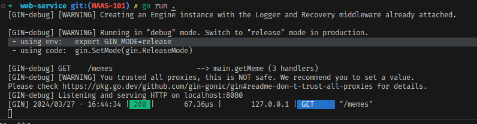
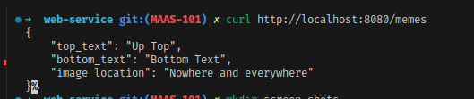
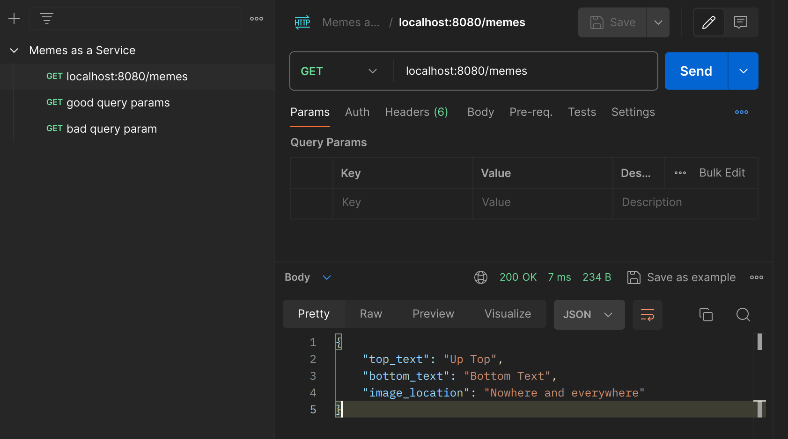
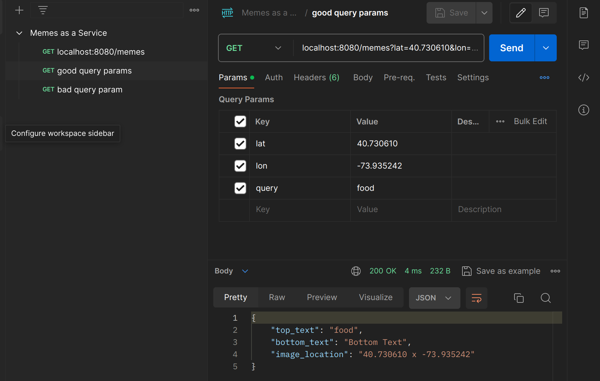
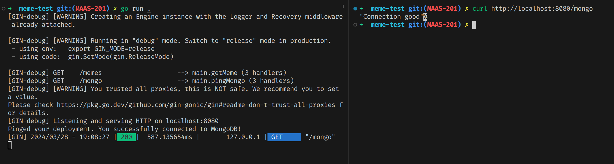

# Kyle Hatfield's Submission for Esusu's Domain Challenge

This is where I plan to walk you through my approach to this test. 

My first step is to try to list out all requirements for each question in order to make sure I fully grasp the problem. I will also be adding in my initial ideas with after a `>` in the line below, just to show my notes. 


## Running this project
Note: I am doing this on my Ubuntu laptop, so I will be writing these instructions assuming a unix-like environment. Any specific installation notes will be for Ubuntu. I expect this would work on MacOS as well, but installation steps would be different.
1) Ensure `go` is installed and working on your machine.
2) navigate to the `meme-test` directory (where this readme is stored). 
3) Run `go build` to compile
4) Run `go run .` to start the server
5) Run `go test ./...` to run all tests

## Requirements
Memes as a Service (MaaS) is an API for fetching memes with one API call

GET /memes/

There are 3 possible URL parameters
- lat : float corresponding with a user's GPS latitude
- lon : float corresponding with a user's GPS longitude 
- query: free text

example:

`GET /memes?lat=40.730610&lon=-73.935242&query=food`
> According to google, it _wood_ look like our user is calling from a lumber yard at `37 Railroad Ave, Long Island City, NY 11101`, so a smart meme might be a beaver on their lunch break. 


### Problem 1: 
- Develop a microservice in Golang to implement the memes API

> Interestingly enough, from the example we can determine that for the lat and lon params they are expecting a float with exactly 6 decimal places of accuracy based on the example latitude ending in a 0. Also worth noting that neither example given is in degrees/minutes/seconds notation, but rather a decimal representation of degrees. 
- Return a payload
  - Initial payload will probably just be a dummy string
  - Eventually would like to do _some_ form of generation (maybe hit a meme page API?)
  - Alternatively, if I could get some form of automated image manipulation figured out in time, might be worth trying to grab a screenshot of the address and just literally have the top text be the query and the bottom text just be "Bottom text" in impact font... and now I am wondering if imgflip has a free public API I could hit. Or something similar. We'll see.
### Problem 2
- We want to charge clients on a per-API-call basis by allowing them to purchase tokens, which are then used to make API calls. 
- Design and implement a system to track the number of times each client has called the memes API. 
  - I can assume the client will include an auth token in the request header to track their identity
- Store token balance in a database to keep track of usage.
- Assume that another team handles the purchasing and they would make an API call to let me know when to add tokens to a client's balance. 
- Data should persist when server is restarted 
- Support 100 requests per second 
  - This makes me think I am _probably_ not gonna do any automated image stuff locally


> Initial thought: probably make a fairly simple user api with something like "AuthKey, IsAdmin, and Tokens". Then any user could get their own token data, but only one with isAdmin could get other user's data. Admins can also POST to create new users and PATCH to update token counts. 

### Problem 3
Answer the following questions concerning scale:
- How will you handle CI/CD in the context of a live service?
- How will you model and support SLAs? What should operational SLAs be for this
service?
- How do you support geographically diverse clients? As you scale the system out
horizontally, how do you continue to keep track of tokens without slowing down
the system?

As I was working on MAAS-201 I found [this writeup](https://www.mongodb.com/developer/languages/go/interact-aws-lambda-function-go/) that honestly sums up a decent chunk of how I wanted to answer problem 3 so I thought I would include it 

### Problem 4
Make sure only the high rollers get the AI memes. Ensure this doesn't slow anything down (I feel like the solution here is to just have this as part of the token check? Like, each user will have a token count and a "AiEnabled" flag or something)

## Questions
On the day I was sent this, I compiled a list of questions I still had for the sake of getting things sorted.  
Note, for the sake of time I had to make some assumptions on this so I will be including those below.  
1) Is there a preferred database I should use? 
   > Assumption: PostgresQL and MongoDB are listed in the JD and I have never used MongoDB, so I went with that to learn it.
2) Do I need to worry about bad input? Examples: 
     - someone provides a non-expected query parameter. 
     - Someone requests a meme when out of tokens
     - Someone provides a latitude or longitude that is improperly formatted (ex: lat=`40°73'61.0"N` or `lat=yes`)?
     - Someone provides a latitude or longitude that is impossible (ex: lat=500.1)
    > Assumption: I decided to go with the middle ground here. Extra params are allowed but ignored. `lat` and `lon` just have to be floats. A meme request with no tokens should 400. 
3) Is there any expectation of hosting this outside of localhost? If not, are there bonus points for hosting it outside of localhost?
4) Am I implementing actual authentication/authorization, or is the expectation to just have a dummy auth key for a user? 
5) For question 2.d, is it 100 requests per second to the users api that just handles updating token info, or is that for the meme generation as well? My main concern on this one is more my laptop handling the image generation. 
6) For my readme's "How to run" section, can I assume a unix-like environment, or should I test this on a Windows machine?

I sent these questions to Mark. 

## Design


## Process
I'm going to be using git to track my code. My plan is to have everything set up in such a way that each "ticket" defined below will be done in a separate local branch and then squashed and merged into master after they are implemented. Each ticket will also include a note determining if it is a need, a want, or a nice-to-have. Needs are explicitly called out as necessary. Wants are things that I really want to put in, but will be dependant on time. Nice to haves are things I would add given time but don't necessarily expect to get done in the 72 hour timeline. 

Tickets will be formatted as such MAAS-[Question Number][SubStep Number with 2 digits]  
Ex: MAAS-101 would be the first ticket for question 1.

## Tickets
> Note: I am editing this in VS Code. In order for the check boxes below to show up in the preview as they do in Github I had to add the [Markdown All in One](https://marketplace.visualstudio.com/items?itemName=yzhang.markdown-all-in-one) plugin. To install it in your instance, open the Quick Open (`ctrl` + `P`) and paste `ext install yzhang.markdown-all-in-one`
- [x] MAAS-001: Initial setup of documentation
  - If this doc is done, so is this ticket
- [x] MAAS-101: Set up a golang API with GET /memes defined - NEED
  - At this point we just want to return 200 OK for anything
  - Server terminal:  
    
  - Curl terminal:   
    
- [x] MAAS-102: Take in the `lon`, `lat`, and `query` - NEED 
  - Update the /memes api to return a json string formatted as such
  ```json
  {
    "top_text": #{query},
    "bottom_text": "Bottom Text",
    "image_location": #{lat x lon},
  }
  ```
  - if fields are missing, use default
   ```json
    {
      "top_text": "Up Top",
      "bottom_text": "Bottom Text",
      "image_location": "Nowhere and everywhere"
    }
  ```
  - lat and lon are both floats
  - query is a free text field
  - ~~For the sake of this assignment, I am going to assume proper input~~ Adding slight validation was pretty quick. 
  - Terminal Screenshot: 
  - Postman Screenshots: 
    
    

- [ ] MAAS-103: Build out some form of image generation - WANT
  - Vague at the moment because I need to get the NEEDS done before I get distracted into the WANTs
  
- [x] MAAS-201: Integrate with a Database - NEED
  - The JD lists MongoDB and PostgresQL, so I will use one of those based entirely on what looks easiest at the moment.
  - I haven't heard back on my questions, so I am gonna just go with MongoDB since I haven't used it before and I'm always looking to learn. 
  - I threw together a quick .env.local file with a default user who will expire in a week. With more time I would do more with preparing for different environments, but for now this works as a proof of concept. 
  - Terminal where I test the connection 
  - At the moment I plan on eventually dropping that endpoint, so I didn't add unit tests. If this endpoint sticks around, I will change that. 
  - Side update: the rest of my notes may be somewhat sparse. In order to make the 72 hour deadline, I am going to have to pick up the pace. I will try to keep key points present.

- [ ] MAAS-202: Build out "USER" object that gets stored in the DB  - NEED
  - Contains at least the following fields: `USER_ID`, `AUTH_KEY`, `IS_ADMIN` and `TOKENS_REMAINING`
  - -`USER_ID` will either be a random number or just an incremented value. 
- [ ] MAAS-203: Create GET /users/[UserId] endpoint - NEED
  - At this point, anyone can get any user.
  - Returns a JSON representation of the user
- [ ] MAAS-204: Update GET /memes to take users into consideration - NEED
   -  When a user with no tokens left requests a meme, return a 400
   -  When a user with tokens requests a meme, reduce the token count by 1 and return a meme
- [ ] MAAS-205: Really simple auth
  - I am operating under the following assumptions
    -  auth will just be a string stored in the header
    -  each auth header has a 1:1 mapping to a user id
   -  When a request comes in with no auth header, treat the account as unauthenticated
   -  When a request comes in with an auth header that does not map to a user, treat that request as unauthorized 
- [ ] MAAS-206: Create POST /users endpoint - NEED
  - admins can create new users
  - non-admins get unauthorized
  - requests without auth header get unauthenticated 
  - A post containing an existing user id will give a 400 bad input with a "auth key already taken" response, because this is the only time I could really have that response and that's funny to me. 
- [ ] MAAS-207: Create PATCH /users/[UserId]
  - admins can update existing users
  - non-admins get unauthorized 
  - requests without auth header get unauthenticated 
- [ ] MAAS-300: Write up scalability plans - NEED
  - At least some of it will be hosting on AWS in lambdas, but the exact breakdown will come later. 
- [ ] MAAS-301+: See if I can implement some of my 300 plan. 
- [ ] MAAS-400: Write up AI plans - NEED

## References
I'm gonna be googling a lot of stuff to try to get this worked out in time. As such, I am going to try to keep track of the different things I used. Simple syntax checks will be skipped, but I am going to need to look up some tutorials for setup. 

MAAS-101:
- https://go.dev/doc/tutorial/web-service-gin 
- https://craig-childs.medium.com/testing-gin-json-responses-1f258ce3b0b1
  
MAAS-102: Not gonna lie, I forgot I was trying to keep track of these and forget which ones I was using, so here is the one I used after remembering.  
- https://github.com/gin-gonic/gin/blob/master/context_test.go 

MAAS-201: 
- https://www.mongodb.com/docs/drivers/go/current/fundamentals/connections/connection-guide/
- https://github.com/joho/godotenv 