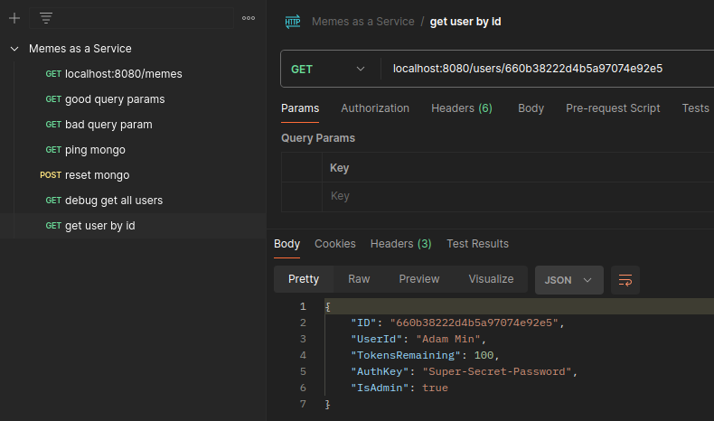

# Tickets
> Note: I am editing this in VS Code. In order for the check boxes below to show up in the preview as they do in Github I had to add the [Markdown All in One](https://marketplace.visualstudio.com/items?itemName=yzhang.markdown-all-in-one) plugin. To install it in your instance, open the Quick Open (`ctrl` + `P`) and paste `ext install yzhang.markdown-all-in-one`
- [x] MAAS-001: Initial setup of documentation
  - If this doc is done, so is this ticket
- [x] MAAS-101: Set up a golang API with GET /memes defined - NEED
  - At this point we just want to return 200 OK for anything
  - Server terminal:  
    
  - Curl terminal:   
    
- [x] MAAS-102: Take in the `lon`, `lat`, and `query` - NEED 
  - Update the /memes api to return a json string formatted as such
  ```json
  {
    "top_text": #{query},
    "bottom_text": "Bottom Text",
    "image_location": #{lat x lon},
  }
  ```
  - if fields are missing, use default
   ```json
    {
      "top_text": "Up Top",
      "bottom_text": "Bottom Text",
      "image_location": "Nowhere and everywhere"
    }
  ```
  - lat and lon are both floats
  - query is a free text field
  - ~~For the sake of this assignment, I am going to assume proper input~~ Adding slight validation was pretty quick. 
  - Terminal Screenshot: 
  - Postman Screenshots: 
    
    

  
- [x] MAAS-201: Integrate with a Database - NEED
  - The JD lists MongoDB and PostgresQL, so I will use one of those based entirely on what looks easiest at the moment.
  - I haven't heard back on my questions, so I am gonna just go with MongoDB since I haven't used it before and I'm always looking to learn. 
  - I threw together a quick .env.local file with a default user who will expire in a week. With more time I would do more with preparing for different environments, but for now this works as a proof of concept. 
  - Terminal where I test the connection 
  - At the moment I plan on eventually dropping that endpoint, so I didn't add unit tests. If this endpoint sticks around, I will change that. 
  - Side update: the rest of my notes may be somewhat sparse. In order to make the 72 hour deadline, I am going to have to pick up the pace. I will try to keep key points present.

- [x] MAAS-202: Build out "USER" object that gets stored in the DB  - NEED
  - Contains at least the following fields: `USER_ID`, `AUTH_KEY`, `IS_ADMIN` and `TOKENS_REMAINING`
  - ~~-`USER_ID` will either be a random number or just an incremented value. ~~
  - Upon reading a bit more into mongodb, I am going to just have the automatically generated `_id` field count as the user id. 
  - I'm also going to make a couple of more dangerous endpoints for the sake of debugging. Namely `POST /users/reset`, which resets the database to a known user set, and `GET /users/debug` which returns all users regardless of if the requester is an admin. 
  - 
  - 
  - 

- [x] MAAS-203: Create GET /users/[UserId] endpoint - NEED
  - At this point, anyone can get any user.
  - Returns a JSON representation of the user
  - 
  - 
  - 
  
  
- [x] MAAS-205: Really simple auth
  - I am operating under the following assumptions
    -  auth will just be a string stored in the header
    -  each auth header has a 1:1 mapping to a user id
   -  When a request comes in with no auth header, treat the request as unauthorized
   -  When a request comes in with an auth header that does not map to a user, treat that request as forbidden
  
  
  
  
  
  

- [x] MAAS-204: Update GET /memes to take users into consideration - NEED
   -  When a user with no tokens left requests a meme, return a 400
   -  When a user with tokens requests a meme, reduce the token count by 1 and return a meme
   -  Relevant Users Before 
   -  Alice meme request 
   -  Bob meme request 
   -  Relevant users after, notice that Alice has lost a token. 

- [ ] MAAS-206: Create POST /users endpoint - NEED
  - admins can create new users
  - non-admins get unauthorized
  - requests without auth header get unauthenticated 
  - A post containing an existing user id will give a 400 bad input with a "auth key already taken" response, because this is the only time I could really have that response and that's funny to me. 
- [ ] MAAS-207: Create PATCH /users/[UserId]
  - admins can update existing users
  - non-admins get unauthorized 
  - requests without auth header get unauthenticated 
- [ ] MAAS-300: Write up scalability plans - NEED
  - At least some of it will be hosting on AWS in lambdas, but the exact breakdown will come later. 
- [ ] MAAS-301+: See if I can implement some of my 300 plan. 
- [ ] MAAS-400: Write up AI plans - NEED
- [ ] MAAS-002: Re-read the code, self PR. 


- [ ] MAAS-103: Build out some form of image generation - WANT
  - Vague at the moment because I need to get the NEEDS done before I get distracted into the WANTs